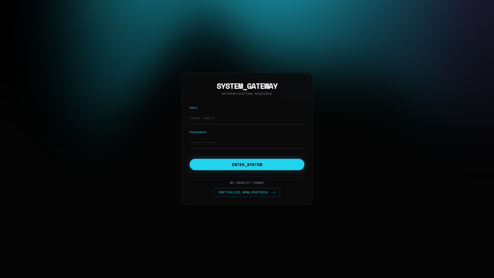
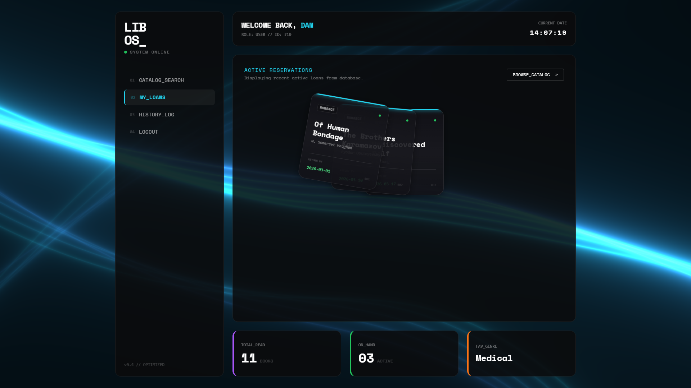
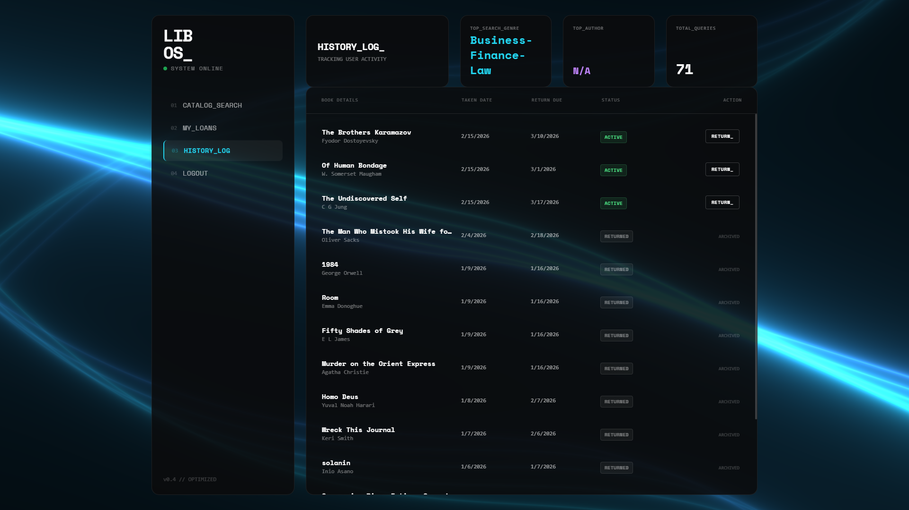
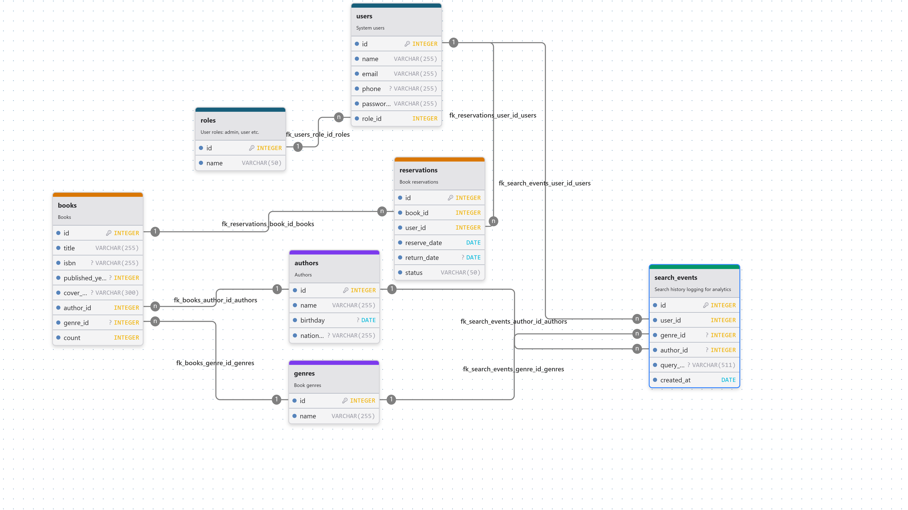
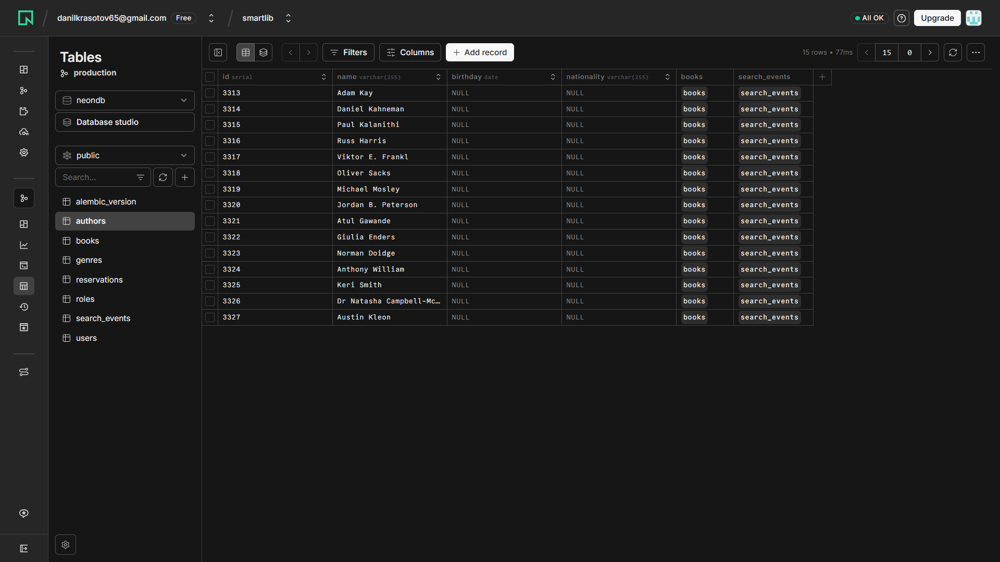

<div align="center">

# LibOS -- Library Management System

A full-stack library management system built with FastAPI, SQLAlchemy and vanilla JS.  
Focused on database design, REST API architecture and user analytics.

**[Live Demo →](https://libraryos-277c.onrender.com)**

<p>
  
  
  
  
  
  
  
  
</p>

</div>

---

## Screenshots

<div align="center">
  
  <p><em>Authentication screen with GLSL shader background and multi-step registration</em></p>
</div>

<div align="center">
  
  <p><em>User dashboard - active loans, personal stats, animated card stack</em></p>
</div>

<div align="center">
  
  <p><em>Book catalog - search, filter by genre/author, sort, paginated loading</em></p>
</div>

<div align="center">
  
  <p><em>History Log - all loans, activity stats, return of books</em></p>
</div>

<div align="center">
  
  <p><em>Database schema - 7 tables, normalized to 3NF</em></p>
</div>

<div align="center">
  
  <p><em>Cloud PostgreSQL on Neon - serverless database with branching</em></p>
</div>

---

## Architecture & Tech Decisions

### Why these technologies?

| Layer | Technology | Reasoning |
|-------|-----------|-----------|
| **API** | FastAPI | Async-ready, auto-generated OpenAPI docs, native Pydantic validation, dependency injection system |
| **ORM** | SQLAlchemy 2.0 | Mapped column syntax for type safety, `joinedload` for N+1 prevention, relationship cascades |
| **Migrations** | Alembic | Version-controlled schema changes, naming conventions for constraints, rollback support |
| **Database** | PostgreSQL (Neon) | Serverless cloud Postgres, role-based access (owner vs app_user), CHECK constraints, partial unique indexes |
| **Auth** | JWT + Argon2 | Stateless tokens via `PyJWT`, password hashing with `pwdlib[argon2]` |
| **Frontend** | Vanilla JS + Tailwind + Three.js | Single-page app with no framework overhead; GLSL shaders for background; GSAP for transitions |
| **Deploy** | Render.com | Auto-build from Git, environment variables, free tier for demo |

### Database Design

The schema consists of **7 tables** normalized to **3NF** with enforced referential integrity:

```
roles ──< users ──< reservations >── books >── authors
                 ──< search_events >── genres
```

**Key constraints & design choices:**
- `ck_reservations_dates` - CHECK constraint ensuring `return_date >= reserve_date`
- `ON DELETE CASCADE` on reservations when user/book is removed
- `ON DELETE RESTRICT` on roles - prevents deleting a role with existing users
- `ON DELETE SET NULL` on books.genre_id - books survive genre deletion
- `server_default` for `reserve_date` and `status` - defaults handled at DB level, not app level
- Naming convention applied to all constraints via SQLAlchemy `MetaData(naming_convention=...)` for predictable migration diffs

### Search Analytics

Every catalog query with filters (genre, author, text search) is logged into `search_events` table. This enables per-user analytics:

- **Top searched genre** - aggregated from `search_events` with `GROUP BY` + `ORDER BY count DESC`
- **Top searched author** - same pattern, joined through `author_id`
- **Total queries** - simple count per user
- **Favorite genre** - computed from actual reservation history (returned books), not searches

This separation between "what user searches for" vs "what user actually reads" is intentional - it mirrors real analytics patterns.

---

## Features

### Authentication & Authorization
- Multi-step registration with client-side validation
- JWT token-based auth with configurable expiration
- Password hashing with Argon2 (`pwdlib`)
- Route-level access control - users can only access their own data
- Token auto-refresh handling on 401 responses

### Book Catalog
- Paginated loading with `skip/limit` (server-side)
- Filter by genre and author (dropdown populated from DB)
- Full-text search across title and author name (`ILIKE`)
- Sort by title (A-Z / Z-A)
- Real-time availability indicator (green/red dot based on `book.count`)

### Reservation System
- Modal with preset durations (1 week / 2 weeks / 1 month) or custom days
- Automatic stock decrement on reservation, increment on return
- Overdue detection - status auto-transitions from $\color{green}{\textsf{active}}$ to $\color{red}{\textsf{overdue}}$ when `return_date < today`
- Duplicate reservation prevention (same user + same book)

### User Dashboard
- Active loans displayed as animated card stack (GSAP + CSS transforms)
- Personal statistics panel: total read, currently on hand, favorite genre
- History log with all reservations (sorted: $\color{red}{\textsf{overdue}}$ → $\color{green}{\textsf{active}}$ → $\color{gray}{\textsf{returned}}$)
- One-click book return from history view

### Frontend
- Single-page application with page morphing transitions (login ↔ dashboard)
- GLSL fragment shader background (aurora effect morphing into wave lines via `uMorphProgress` uniform)
- Three.js for WebGL rendering, GSAP for DOM animations
- State persistence - last viewed page saved to `localStorage`

---

## API Reference

All protected endpoints require `Authorization: Bearer <token>` header.

| Method | Endpoint | Description | Auth |
|--------|----------|-------------|------|
| `POST` | `/api/register` | Create new user account | ✗ |
| `POST` | `/token` | Get JWT access token | ✗ |
| `GET` | `/api/me` | Current user profile | ✓ |
| `GET` | `/api/users/{id}` | User by ID (own only) | ✓ |
| `GET` | `/api/books/` | Paginated book catalog with filters | ✓ |
| `GET` | `/api/genres/` | All genres | ✗ |
| `GET` | `/api/authors/` | All authors | ✗ |
| `POST` | `/api/reservations/` | Create reservation | ✓ |
| `PATCH` | `/api/reservations/{id}/return` | Return a book | ✓ |
| `GET` | `/api/users/{id}/reservations/` | Active user reservations | ✓ |
| `GET` | `/api/users/{id}/history/` | Full reservation history | ✓ |
| `GET` | `/api/users/{id}/analytics/` | User search & read stats | ✓ |

Query parameters for `GET /api/books/`:

| Param | Type | Description |
|-------|------|-------------|
| `skip` | int | Offset for pagination (default: 0) |
| `limit` | int | Page size (default: 8) |
| `genre_id` | int | Filter by genre |
| `author_id` | int | Filter by author |
| `search` | str | Search in title/author name |
| `sort` | str | `asc` or `desc` by title |

---

## Project Structure

```
├── main.py                  # FastAPI app, routes, auth middleware
├── app/
│   ├── models.py            # SQLAlchemy ORM models
│   ├── schemas.py           # Pydantic request/response schemas
│   ├── crud.py              # Database operations, business logic
│   └── db.py                # Engine & session configuration
├── alembic/
│   └── versions/            # Migration history
├── scripts/
│   ├── dataset.py           # Kaggle dataset import script
│   ├── db-connect.ps1       # Neon psql wrapper with role switching (Windows)
│   └── db-connect.sh        # Neon psql wrapper with role switching (Linux)
├── static/
│   ├── index.html           # SPA frontend
│   └── covers/              # Book cover images
├── render.yaml              # Render.com deployment config
└── requirements.txt
```

---

## Getting Started

### Prerequisites
- Python 3.11+
- Optional (if an own database is needed): PostgreSQL database (local or [Neon](https://neon.tech))

### Setup

```bash
git clone https://github.com/dackey-wav/library-os.git
cd library-os

python -m venv venv
venv/bin/activate  # Linux: source venv\Scripts\activate

pip install -r requirements.txt

cp .env.example .env
# Fill in your database credentials and secrets in .env
```

### Run migrations

```bash
alembic upgrade head
```

### Import dataset (optional)

```bash
python -m scripts.dataset
```

### Start server

```bash
uvicorn main:app --reload
```

Open [http://localhost:8000](http://localhost:8000) in your browser.

### Connect to remote DB directly

Helper scripts for quick `psql` access to Neon - they read connection strings from `.env` and support **role-based access** (`owner` with full DDL privileges vs `user` with restricted DML-only):

```bash
# Windows
./scripts/db-connect.ps1 owner          # default - full access
./scripts/db-connect.ps1 user           # app role - restricted
./scripts/db-connect.ps1 owner -c "SELECT count(*) FROM books"

# Linux
./scripts/db-connect.sh owner
./scripts/db-connect.sh user -c "SELECT count(*) FROM books"
```

> For a local PostgreSQL instance, standard `psql -U postgres -d mydb` is sufficient - these scripts exist specifically to simplify working with remote connection strings that include SSL params and long hostnames.

---

## Known Limitations & Future Improvements

- **No admin panel** - CRUD operations for books/users are only available through direct DB access
- **No refresh tokens** - current JWT implementation uses only access tokens
- **Frontend is a single HTML file (~1500 lines)** - works well for the scope but would benefit from component extraction
- **No test coverage** - adding pytest would be a natural next step
- **Search is `ILIKE`-based** - for larger datasets, PostgreSQL full-text search (`tsvector`) or trigram indexes would perform better
- **No rate limiting** on auth endpoints

---

## 📄 License

[MIT](LICENSE) © dackey-wav
